# Generative AI and Structural Change in Crowdsourced Music Information Platforms

—Evidence, Mechanisms, and Open Questions from AOTY (Album of the Year) and RYM (RateYourMusic)

## Abstract

This study investigates how generative AI may alter the institutional foundations of crowdsourced music-information platforms. Album of the Year (AOTY) and Rate Your Music (RYM) serve as cases through which to examine three connected structures: the production of evaluative content, the allocation of visibility and rating weight, and the provenance of community knowledge. The empirical analysis uses three documented third-party archives: 32,358 historical AOTY album records, an AOTY high-rated snapshot of 5,000 albums, and an RYM popular-album snapshot of 5,000 albums. Across 4,102 exact artist-title-year matches, AOTY and RYM user scores correlate at 0.910, and 87.4% of matched scores differ by no more than 0.5 points on a common 0-5 scale. Rating attention is concentrated within both selected snapshots, while written reviews form a comparatively thin participation layer in the RYM archive. These observations identify the platform structures through which low-cost generated contributions could affect information quality and trust. They do not establish that a post-2022 transformation has already occurred. A controlled text-classification exercise, synthetic structural-break tests, and governance scenarios develop testable mechanisms and specify the evidence required for causal evaluation. The study's contribution lies in connecting generative content production to platform structure: as review-like text becomes inexpensive, verifiable provenance, contribution history, and ranking design become more consequential to the value of crowdsourced knowledge.

**Keywords:** generative AI; structural change; crowdsourced music platforms; platform governance; data provenance; user ratings; trust

## Table of Contents

## Part 1 In-Depth Industry Analysis

### I. Industry Overview and Development Assessment 

1.1 Industry Overview 

1.1.1 Industry Definition and Boundaries 

1.1.2 Development History 

1.1.3 Market Size and Industry Chain Structure 

1.2 Platform Characteristics and Trends

1.2.1 Business Model 

1.2.2 Technology Development Stages 

1.2.3 Competitive Landscape 

### II. Macro-Environmental and Governance Analysis

2.1 Economic Conditions and Cultural Consumption

2.1.1 Recorded-Music Growth and Platform Demand

2.1.2 Regulatory Context and Platform Governance

2.2 Structural Pressures on UGC Evaluation Institutions

2.2.1 An Illustrative Test of the Lemons-Market Hypothesis

2.2.2 Trust Heterogeneity and Core-Contributor Risk

2.2.3 Technology-Institution-Organization-Value Transmission Framework

2.3 Strategic Options under Current Conditions

### III. Market and Competitive Landscape Analysis 

3.1 Market Structure

3.1.1 Product Categories and Growth Drivers

3.1.2 Genre-Level Participation

3.2 Potential Changes in the Competitive Landscape

3.2.1 Analyst-Coded Platform Positioning and AI-Related Exposure

3.2.2 Data Assets, Community Participation, and Entry

3.3 Platform Case Analysis

3.3.1 RYM: Data Depth and Governance Constraints

3.3.2 AOTY: Social Participation and Governance Constraints

3.3.3 Douban Music: Potential Structural Vulnerabilities

3.3.4 Cross-Case Comparison

## Part 2 Professional Application and Researcher Development

### IV. Industry Employment Prospects and Talent Demand 

4.1 Employment Opportunities and Challenges 

4.1.1 Changes in the Employment Structure 

4.1.2 Employment Opportunities 

4.1.3 Employment Challenges 

4.2 Talent Demand Trends 

4.2.1 Changes in Corporate Recruitment Preferences 

4.2.2 Emerging Roles 

### V. Occupations and Competencies

5.1 Typical Roles and Development Paths 

5.1.1 Career Development Routes 

5.1.2 Comparison of Enterprise Types 

5.1.3 Job Substitution Risk Assessment 

5.2 Essential Skills 

5.2.1 Skills for Platform Governance

5.2.2 Communication and Judgment Skills

### VI. Personal Career Planning and Job Search Strategies 

6.1 Competitiveness Enhancement 

6.1.1 The Three-Year Competency Improvement Plan 

6.1.2 Internship and Project Selection 

6.1.3 Professional Network Building 

6.2 Job Search Actions 

6.2.1 Target Company Selection 

6.2.2 Interview Preparation 

6.2.3 Job Application Materials 

6.3 Personal Positioning and Development 

6.3.1 The Three Stages of Long-Term Development 

6.3.2 Path Selection 

### VII. Career Development Risks and Responses 

7.1 Risk Identification 

7.1.1 Industry-Level Risks 

7.1.2 Individual-Level Risks 

7.2 Response Strategies 

7.2.1 Improving Career Adaptability 

7.2.2 Crisis Response 

7.2.3 Learning Strategies 

## Part 3 Summary 

### VIII. Conclusions and Recommendations

8.1 Conclusions

8.2 Industry Strategic Recommendations 

8.3 Recommendations for Practitioners 

## Part 4 Appendices 

### Appendix A Detailed Tables of Research Data and Statistical Analysis 

A.1 Key Statistics of the RYM Rating Time Series 

A.2 Structural Breakpoint Test Results 

A.3 Controlled Text-Classification Performance

A.4 Linguistic Features in the Controlled Corpus

A.5 Trust Threshold Model Parameters 

A.6 User-Group Trust Thresholds 

A.7 Quantitative Scores of the Competitive Landscape 

### Appendix B Minutes of Community Discussions 

### Appendix C Methodology and Technical Route 

### Appendix D References 

### Appendix E List of Figures and Tables 

I. Analysis Figures (Figure 1-Figure 12) 

II. Illustrative Figures (Figure A-Figure K) 

Data Ethics Statement 

# Part 1 In-Depth Industry Analysis

## I. Industry Overview and Development Assessment

### 1.1 Industry Overview

#### 1.1.1 Industry Definition and Boundaries

This study examines music information platforms centered on user-generated ratings, reviews, lists, and classifications. These services generally do not control music creation, copyright ownership, or distribution. They organize evaluative information through aggregated scores, charts, community discussion, database lookup, and discovery tools. The evidence base includes three documented third-party archives [18]: 32,358 AOTY album records through October 2020, an AOTY top-5,000 snapshot updated in October 2024, and an RYM top-5,000 popularity snapshot collected in March 2022. These files support descriptive comparisons. The post-2022 structural-break claim still lacks a repeated platform time series, so the synthetic series is retained only as a method check.

The study addresses three questions. First, which features of crowdsourced music-information platforms create exposure to low-cost generated contributions? Second, how do score agreement, attention concentration, and written participation differ across the selected AOTY and RYM archives, and how might those structures mediate AI-related pressure? Third, which longitudinal observations and identification strategies could distinguish generative-AI-associated change from shifts in catalog composition, user cohorts, ranking rules, and platform policy? The first two questions combine theoretical interpretation with descriptive evidence. The third establishes the requirements for a later causal test.

The analysis draws on information asymmetry and signaling [1, 2], institutional analysis [3, 8], theories of trust and threshold behavior [4, 5], and research on platform moderation [9]. Transformer architectures and foundation-model research provide technical context for changes in text production [10, 11], while scholarship on generative AI in creative fields situates the wider governance question [12]. Research on generated-text detection [13, 14] indicates why a text classifier cannot, by itself, establish authorship or platform-level prevalence.

The central proposition concerns a change in scarcity. Crowdsourced evaluation systems developed when coherent reviews usually required time, knowledge, and an identifiable history of participation. Generative systems reduce the cost of producing the text itself. The scarce resources then become credible provenance, accountable contribution histories, and institutional knowledge about how ratings and reviews were weighted. This shift can affect platform value before any generated review becomes indistinguishable from expert criticism. It changes what platforms must document, what users must assess, and which forms of participation deserve protection. The proposition defines a structural mechanism. Its magnitude and timing on AOTY and RYM remain empirical questions.

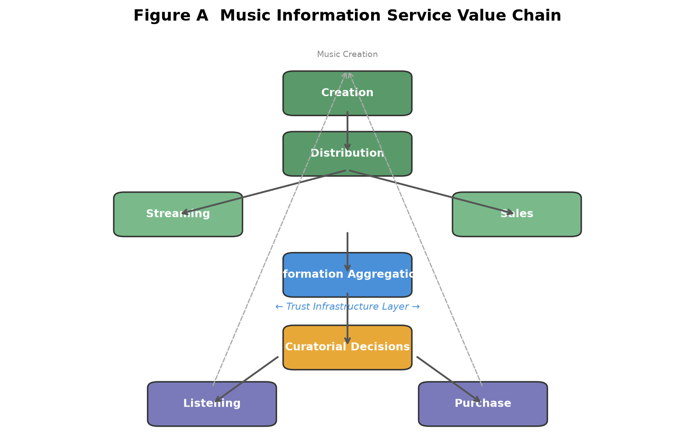

Within the music industry, information platforms sit between music production and distribution services on one side and discovery and consumption decisions on the other. AOTY and RYM aggregate ratings, reviews, charts, and metadata that can reduce the time required to compare releases. The available data do not measure how strongly these services affect listening or purchasing behavior.

AOTY (founded in 2009) and RYM (founded in 2002) are prominent crowdsourced music-rating platforms. Their staying power can be examined through three accumulated assets.

The first is the temporal barrier and data depth. RYM has accumulated album metadata, user ratings, lists, and genre information over many years. AOTY combines user scores with published reviews and chart functions. The observed archives represent 30.4 million ratings and 506,510 reviews in the selected RYM sample, plus 6.28 million ratings in the selected AOTY top-5,000 sample. These are sample totals, not platform totals. Their scale still makes one point concrete: the accumulated record is large enough that provenance, ranking rules, and moderation choices can alter what later users inherit as musical knowledge.

The second is the community barrier and reputation mechanism. RYM users contribute fine-grained genre labels, lists, ratings, and reviews; AOTY connects ratings with annual lists, profile distributions, and following activity. A long review or a disputed genre vote has value beyond its text because it sits inside a visible contribution history. Generated prose can imitate the surface of a review. It does not automatically inherit the account history, listening context, or peer response attached to that contribution.

The third is the taxonomy and knowledge system. RYM maintains a detailed genre hierarchy shaped by long-running community discussion. Genre definitions and boundaries carry a record of those decisions. AOTY places more emphasis on annual, decade, and genre charts. A generated taxonomy can copy labels, while the history and reasons behind community decisions still require documentation.

These three forms of accumulation interact. Historical depth broadens the data, community participation supports review and classification quality, and taxonomy gives the records structure. Generated or coordinated content could weaken these relationships if it becomes difficult to identify contributors and assess the origin of ratings. The scale of that risk remains an empirical question.
#### 1.1.2 Development History

The evolution of music information service platforms can be divided into four stages.

The first stage was the static-database period of the Web 1.0 era (the 1990s to 2004). AllMusic, founded by Michael Erlewine in 1991, used an editorial model in which professional critics produced biographies, album reviews, and genre descriptions for a structured music database. Data licensing to retailers formed part of its business model. This centralized approach gave editors substantial influence over coverage and classification.

Editorial capacity constrained the number of releases that could receive detailed coverage. Selection and classification decisions were concentrated within professional editorial teams, which limited direct user participation in producing evaluations. The consequences for independent and less-visible releases would require historical coverage data to estimate.

The second stage was the UGC expansion of the Web 2.0 era (2005 to 2015). RYM and Douban Music (founded in 2005) widened participation in music evaluation, while AOTY later combined published criticism with user scores and social features. The period established two durable assets: structured music records and visible histories of community contribution.

The third stage was the mobile internet and algorithm era (2015 to 2022). The rise of streaming platforms introduced the algorithmic recommendation paradigm, changing the way users discovered music and bringing new competitive pressure to UGC evaluation platforms.

Streaming services integrated music discovery with playback. Recommendation products such as Spotify's Discover Weekly, launched in 2015, reduced the effort required to find new music and concentrated more activity within streaming interfaces. AOTY and RYM continued to organize ratings, reviews, charts, and catalog context. The two product types support different information tasks, although the project does not measure substitution between them.

Streaming platforms also added social and discovery functions, including friend activity and shared playlists. Playback remains their central function. Independent evaluation platforms give ratings, reviews, lists, and discussion a more prominent place, which helps explain their distinct audience.

The fourth stage begins with the broad availability of generative AI systems in late 2022. These systems reduced the cost of producing review-like prose and created an additional provenance problem for platforms that accept user contributions. AOTY's own [changelog](https://www.albumoftheyear.org/changelog/) records changes in platform design: user genre charts moved to weighted ranking in October 2025, rating export arrived in April 2026, and weighted critic and user charts became default in June and July 2026. The changelog does not attribute these changes to AI. It documents that ranking rules, rating counts, and data portability are active product decisions.

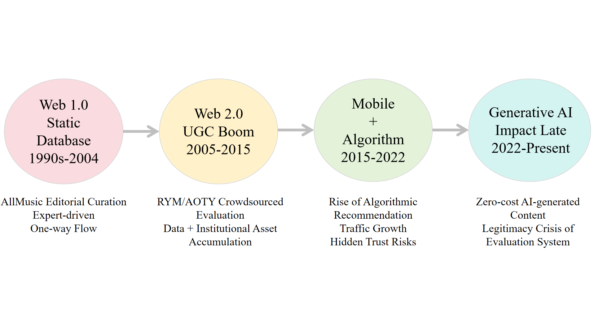

Generative systems make the origin of review-like text harder to infer from prose alone. The controlled text study uses 15 published critic excerpts from the AOTY/Metacritic archive and 15 manually authored assistant-style controls. Five-fold out-of-fold accuracy is 96.7% and AUC is 0.996. The result describes separation between these two small, deliberately contrasted groups. It does not estimate performance on generated text or current RYM or AOTY user reviews.

Generative systems reduce the time required to produce plausible review-like text. This changes the cost of content production, although the size of the change on AOTY and RYM has not been measured. The relevant research question is whether lower production costs alter the volume, provenance, or perceived value of platform reviews.

The response problems of specific platforms may differ. RYM relies heavily on long-term community contributions, while AOTY combines ratings with lighter social participation. The archives make the contrast measurable at one point in time: the median RYM album in its selected sample has 3,973 ratings and 72 written reviews, with a median review-to-rating ratio of 1.65%; the selected AOTY sample has a median of 482 ratings per album. Selection rules differ, so this is a comparison of archive structures, not a platform-size ranking. AOTY's [terms](https://www.albumoftheyear.org/terms-of-use/) already prohibit bots, fake accounts, review bombing, and coordinated rating manipulation. The synthetic forum file remains excluded.

The trust model used in this study allows nonlinear responses under selected parameter values. The synthetic series contains a designed post-November-2022 change, including a rise in short-review share. This pattern is useful for testing code and presenting the hypothesis, but it does not show that the same change occurred on RYM.

#### 1.1.3 Market Size and Industry Chain Structure

According to IFPI's [Global Music Report 2026](https://www.ifpi.org/global-music-report-2026-global-recorded-music-revenues-grow-6-4-as-record-companies-drive-innovation/) [15], global recorded-music revenue reached $31.7 billion in 2025, up 6.4% in the eleventh consecutive year of growth. Paid streaming accounted for 52.4% of revenue. IFPI does not provide a separate market total for music-rating and review platforms in the cited release.

No reliable market-size series was found for music-rating and review platforms as a separate category. A credible estimate would need non-overlapping segment definitions, a dated source for each input, and a clear treatment of advertising, subscriptions, data licensing, criticism, curation, and transaction-linked services.

The industry-chain scores in this study are analyst-coded scenarios. They compare dependence on user ratings, editorial review, transactions, and recommendation systems. The scores have not been estimated from observed losses, moderation costs, or user behavior, so they should be used to organize comparison and design later measurements.

Information aggregators depend heavily on reliable user contributions and often have fewer technical or financial resources than large streaming services. That combination may increase their exposure to manipulation. The scenario scores express this concern, but they do not measure actual losses or predict which platforms will survive.

### 1.2 Platform Characteristics and Trends

#### 1.2.1 Business Model

The business model of music information service platforms can be abstracted as a cycle: trust accumulation drives user participation, user participation drives data production, data production drives service value addition, service value addition drives trust monetization, and part of the monetization revenue is reinvested in trust maintenance. Specifically, platforms establish user trust by providing a reliable evaluation system (rigorous rating mechanisms, transparent data presentation, active community self-governance); trust attracts users to contribute evaluations; users' ratings and reviews constitute the platform's data assets; value-added services such as charts, recommendations, and data licensing are provided based on the data assets; and commercial returns are realized through advertising, subscriptions, and data licensing.

The model may become less effective when users cannot evaluate the origin or quality of contributions. Two mechanisms provide testable explanations for that risk.

The first mechanism concerns signal quality. If low-cost generated reviews become common and remain difficult to identify, readers may spend more time assessing provenance or rely less on written reviews. Lower readership could then reduce the incentive to produce detailed contributions. This sequence is consistent with an adverse-selection account derived from Akerlof's lemons-market framework [1]. Each link requires behavioral or longitudinal evidence; the current archives do not measure review provenance, reading time, contributor incentives, or exit.

The second mechanism concerns contributor incentives. Likes, comments, follows, points, and labels can reward sustained participation. Cheap generated content may distort those signals when activity is rewarded without adequate checks. The report has no account-level evidence that this has happened on RYM or AOTY.

A possible sequence is an increase in low-cost content, lower visibility for careful reviews, weaker contributor incentives, and declining review quality. Each link needs separate evidence. The model and synthetic data in this project do not establish that sequence on either platform.

#### 1.2.2 Technology Development Stages

The technological development of music information platforms can be organized into three broad stages. The periodization is interpretive and is used to relate product features to governance questions.

Stage 1: The database-driven stage (2002 to 2010). Public product pages organized releases by artist, year, label, genre, track, rating, and review. This structured catalog made comparison and retrieval possible at a scale that editorial pages alone could not provide. The report makes no claim about the platforms' internal software stack, which is not documented in the collected sources.

Stage 2: The social and mobile stage (2010 to 2022). Ratings became easier to publish, compare, and display through profiles, lists, visual distributions, following systems, and mobile interfaces. AOTY made rating history part of a user's public music identity. The available sources describe product features, not recommendation architecture or the front-end frameworks used to build them.

Stage 3: The AI governance stage (2023 to the present). Cheap text generation adds a new abuse channel beside spam, fake accounts, and coordinated ratings. Relevant controls include rate limits, behavioral anomaly detection, contribution histories, disclosed machine assistance, review queues, and appeals. Text classification can support triage. It cannot certify human authorship on its own, and this report does not recommend blockchain as a default remedy.

The report considers four governance questions: text provenance, privacy, rating weights, and human review.

Generated-text detection changes as models and writing practices change [13, 14]. The controlled classifier is evaluated on 15 archived professional-review excerpts and 15 manually authored assistant-style controls, with no platform-user or longitudinal holdout. Its out-of-fold score cannot support claims about named models or a decline between 2023 and 2025. Testing such a claim requires dated platform-native reviews, documented generator settings, and a fixed evaluation protocol.

Authenticity controls can conflict with privacy and low-friction participation. Identity verification, phone confirmation, and contribution histories provide different levels of assurance and impose different costs. C2PA can attach signed provenance statements to digital assets, but it does not establish that a short review reflects an unaided human judgment. Any platform-specific design would require user research, privacy review, an appeal process, and evidence that the control reduces abuse without excluding legitimate contributors.

Rating weights could use documented behavioral signals such as account age, timing, prior activity, and unusual rating patterns. These signals can also penalize legitimate users, so any weighting rule needs validation, an appeal process, and regular bias checks. The current project does not estimate such a score.

Human review remains necessary for ambiguous cases. This project does not estimate the gray-zone share or moderation cost. A practical workflow should set detector thresholds against measured false-positive costs, route uncertain cases to trained reviewers, conceal model confidence during the first human judgment where feasible, and audit disagreement by language, genre, and contributor history.

#### 1.2.3 Competitive Landscape

The scenario organizes major platforms into five groups along two selected dimensions: data depth and social experience. The categories describe product differences and proposed governance exposure; they do not constitute an empirical market classification.

The crowdsourced-knowledge type, represented by RYM, is treated as a database-centered evaluation service. The scenario assigns it high data depth and medium social participation. The observed RYM archive contains 5,000 popular albums with more than 30 million ratings and half a million reviews. This supports a descriptive claim about the selected archive's depth. The vulnerability score remains an assumption, and the value assigned to provenance has not been measured.

The crowdsourced social type, represented by AOTY, combines scores with annual charts, profile distributions, lists, and following activity. The map assigns it 7/10 for data depth and 8.5/10 for social experience; these are analyst scores. The 2024 archive confirms substantial rating activity and high concentration within the selected sample. Whether social participation buffers a loss of rating confidence requires retention and feature-use data that are not available here.

The professional-authority type, represented by Pitchfork, Rolling Stone, and NME, is treated as an expert-curated media category. The scenario assigns medium data depth and low social participation. Bylines and editorial processes provide readers with provenance information that anonymous contributions may lack. The project does not measure whether generated reviews have reduced demand for professional criticism.

The transaction-centered type, represented by Discogs and Bandcamp, combines catalog information with marketplace activity. The scenario assigns high data depth and low-to-medium social participation. Transaction records and seller-reputation systems provide behavioral evidence that is separate from review text, although they do not eliminate manipulation risk.

The algorithmic-recommendation type, represented by Spotify and Apple Music, centers on listening behavior, recommendation, and licensing relationships. The scenario assigns lower exposure to review-authenticity problems because reviews are not the main product. This assessment does not cover catalog fraud, recommendation manipulation, or generated music.

The scenario assigns higher vulnerability to platforms whose main product depends on anonymous user ratings and lower vulnerability to services centered on transactions or listening history. This ordering follows the selected rubric and weights. It should be tested with observed moderation costs, manipulation incidents, contribution patterns, and user research.

## II. Macro-Environmental and Governance Analysis

The environmental analysis focuses on how market conditions, regulation, and technical change may affect platform rules and user participation.

### 2.1 Economic Conditions and Cultural Consumption

#### 2.1.1 Recorded-Music Growth and Platform Demand

IFPI reports $31.7 billion in global recorded-music revenue for 2025, growth of 6.4%, an eleventh consecutive year of expansion, and a 52.4% share for paid streaming. These figures describe recorded music as a whole. They do not measure the revenue of rating and review platforms.

Recorded-music growth does not tell us how review platforms will perform. Streaming makes access easy and leaves a separate problem of comparison, interpretation, and canon formation. AOTY and RYM address that problem through ratings, reviews, charts, and structured catalog context. Their economic relevance depends less on owning audio and more on whether users continue to trust the judgments gathered around it.

Growth in recorded-music consumption may increase demand for discovery and curation, but the cited IFPI figures do not establish demand for independent rating platforms. Testing that relationship would require platform traffic, subscription, referral, or survey data. Trust remains relevant because aggregated judgment is one of the services these platforms provide.

Economic conditions may affect spending on subscriptions, advertising, and cultural services. This project does not contain platform revenue or willingness-to-pay data, so it cannot estimate elasticity or compare the cyclical sensitivity of rating platforms with streaming services. These relationships remain topics for market and user research.

#### 2.1.2 Regulatory Context and Platform Governance

AI governance rules continue to change across jurisdictions. Platforms need current legal review before treating a labeling, detection, or record-keeping practice as a compliance requirement.

The EU AI Act entered into force in August 2024. Its general application date is 2 August 2026, with exceptions and later dates for some high-risk systems. Article 50 transparency obligations also apply from 2 August 2026, subject to their scope and exceptions; they do not create a general duty for every review platform to identify every AI-written post. The current timetable is summarized by the [European Commission](https://digital-strategy.ec.europa.eu/en/policies/regulatory-framework-ai) [16], and platform-specific obligations require legal analysis.

The United States has a changing mix of federal and state rules. This report does not make a platform-specific compliance claim. Any later comparison should identify the service, jurisdiction, regulated conduct, and date before drawing conclusions.

China's Interim Measures for Generative Artificial Intelligence Services took effect on 15 August 2023, and filing continues for covered services. Separate rules on labels for AI-generated synthetic content took effect on 1 September 2025. The duties depend on the service and role concerned; the report cannot infer Douban Music's compliance burden without a product-level legal analysis. Official texts are available from the [Cyberspace Administration of China](https://www.cac.gov.cn/2023-07/13/c_1690898326795531.htm) and its [labeling notice](https://www.cac.gov.cn/2025-03/14/c_1743654684782215.htm).

C2PA Content Credentials can bind signed provenance statements to digital assets. The [C2PA explainer](https://spec.c2pa.org/specifications/specifications/2.2/explainer/Explainer.html) [17] states that a credential does not decide whether the underlying content is true. Applying C2PA to short platform reviews would also require identity, workflow, privacy, and adoption decisions. Possible certification revenue remains a business hypothesis.

Legal obligations may change as jurisdictions implement rules for generated content. Platform duties depend on the service, content, jurisdiction, and date. Automated detection also produces false positives and false negatives, so any compliance use requires legal analysis, validation, human review, documentation, and appeal procedures.

### 2.2 Structural Pressures on UGC Evaluation Institutions

Generative AI introduces a structural pressure because it changes the relationship among text production, contributor effort, and verifiable identity. The proposed transmission sequence begins with lower production costs, moves through uncertainty about provenance and contribution weight, and reaches user reliance, contributor incentives, and the value of accumulated platform data. The sequence offers a theory of platform change and a set of measurable links. The current archives describe the structures on which the mechanism could operate; they do not estimate the prevalence of generated reviews or the size of each effect.

#### 2.2.1 An Illustrative Test of the Lemons-Market Hypothesis

The current analysis now separates what the archives can establish from what still needs a time series. Cross-platform agreement, score calibration, rating concentration, genre profiles, and review participation are observable. A post-2022 break in platform behavior is not.

The structural-break workflow is applied to a synthetic weekly series for 2020 to 2026. The code includes a regression Chow test at a prespecified split [7], a descriptive CUSUM path with bootstrap inference, and Bai-Perron-style dynamic-programming least-squares segmentation [6]. Because the synthetic generator places a change near November 2022, recovering that date is an implementation check. It is not evidence that ChatGPT caused a structural break on RYM.

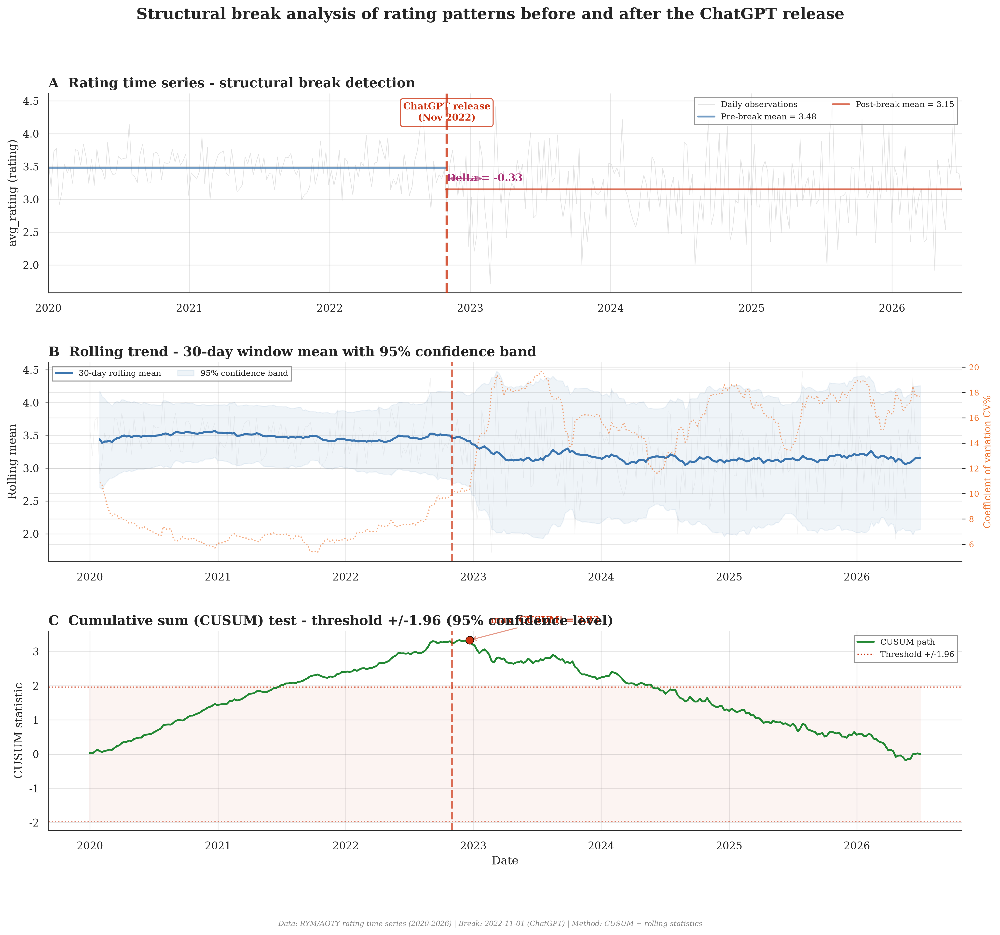

The synthetic benchmark was designed with lower post-split ratings and a different distribution shape. Its pre/post values describe the generator's assumptions. They cannot identify changes in user taste, platform composition, or AI activity. With real observations, the same workflow would need robustness checks for seasonality, release mix, user composition, serial correlation, and alternative break dates.

The short-review, long-review, and review-with-rating shares in the repository are also synthetic. Their changes illustrate variables that should be collected from dated platform snapshots. Until those observations are obtained, the proposed decline in review depth remains a hypothesis and should not be reported with inferential p values.

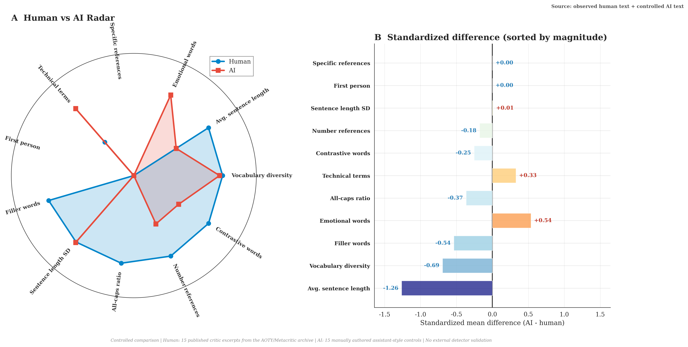

The figure retains the original AI/human shorthand in its title. Its evidential interpretation is narrower: it compares published critic excerpts with manually authored assistant-style controls.

Akerlof's lemons-market model [1] offers one explanation for how uncertainty about quality can affect participation. Applied here, the model predicts that readers may reduce their use of reviews when they cannot assess provenance or quality. Lower readership may then weaken incentives for costly contributions. This application is theoretical: the project has not measured readers' beliefs, review exposure, contributor effort, or exit.

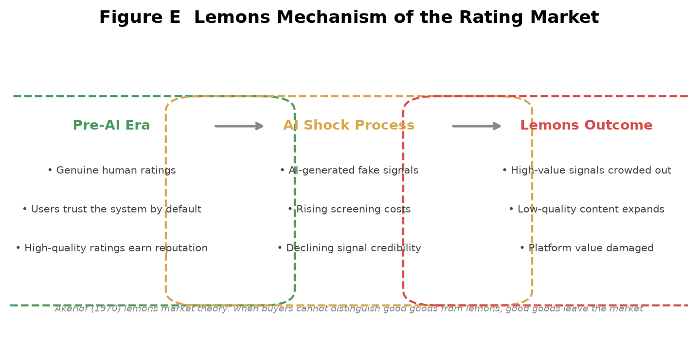

The text comparison provides a limited empirical observation. Published critic excerpts use longer sentences on average than the manually authored assistant-style controls (22.8 versus 12.9 words), while lexical diversity is also higher in the critic sample. These corpus-specific differences motivate a larger provenance study. They provide no estimate of AI prevalence, detector accuracy on model-generated text, adverse selection, or contributor exit.

The strongest observed result lies elsewhere. Among 4,102 exact artist-title-year matches, AOTY and RYM user scores correlate at 0.910; 87.4% sit within half a point after both scales are put on 0-5. AOTY scores remain a median 0.34 points higher. The two communities largely agree on rank order while using different score calibrations. This establishes a durable cross-platform baseline and does not identify an AI effect.

#### 2.2.2 Trust Heterogeneity and Core-Contributor Risk

The matched archive shows strong score agreement, and the RYM snapshot shows that written reviews are much less common than ratings. A later study can examine whether contributor groups differ in their response to doubts about review provenance and whether changes in their activity affect review coverage.

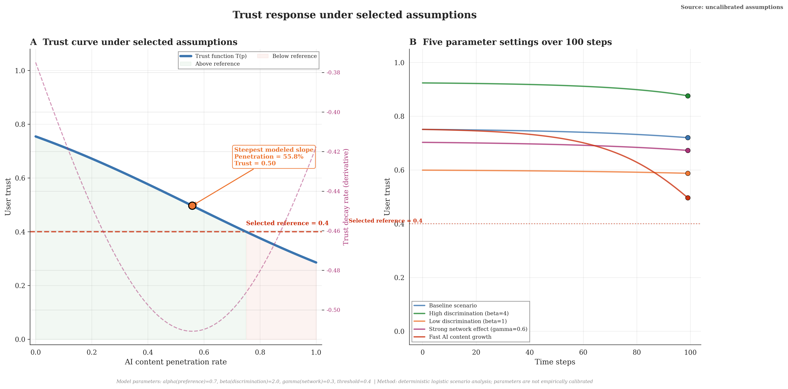

The trust threshold model is an assumption-driven analytical tool. It defines users' trust in a platform as a function of three selected parameters: discrimination β, preference intensity α, and network effect strength γ. With AI penetration rate p as the independent variable, the chosen functional form produces a nonlinear decline in T(p). The curve describes the model specification and is not fitted to observed user behavior.

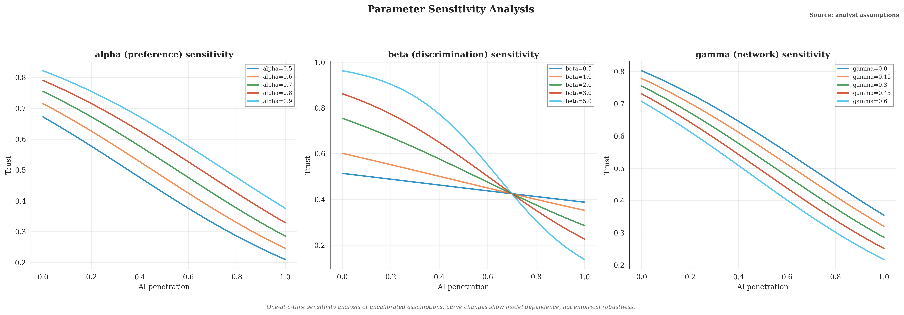

The scenario assigns different parameter values to four user profiles. Under those assumptions, the selected trust reference is crossed at roughly 30%, 45%, 62%, and 80% AI penetration. These values are scenario outputs, not estimates for RYM users, AOTY users, or TikTok traffic. Survey or behavioral data would be needed to estimate the parameters and compare user groups.

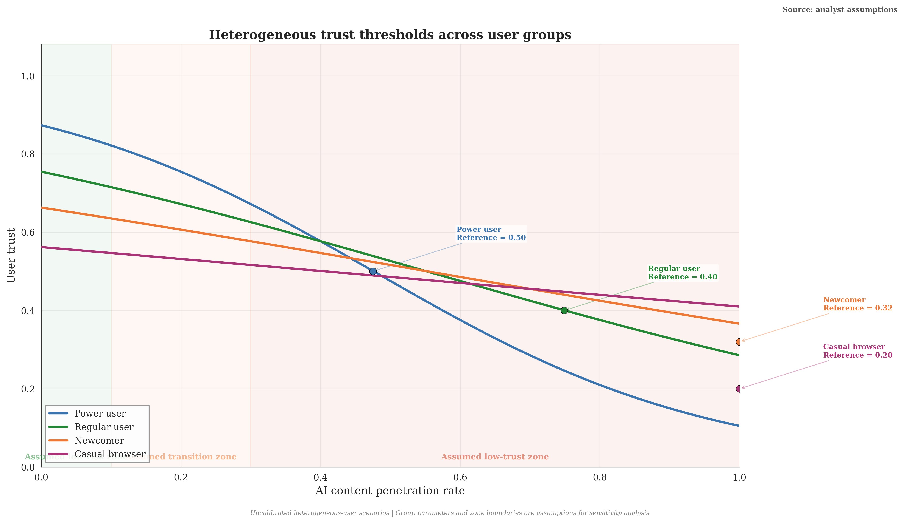

The scenario raises a practical question: do frequent contributors react sooner than casual readers when they doubt review authenticity? If so, total traffic could remain stable while long reviews and taxonomy work decline. The current model does not measure that effect. It would require contributor-level activity and retention data.

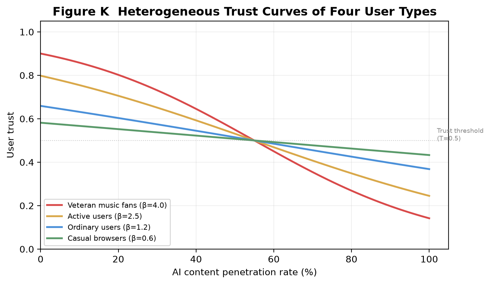

Open rating systems can be vulnerable when coordinated operators create accounts or automate submissions. Equal weighting may increase that exposure, although the weighting rules of particular platforms require direct documentation. The scenario hypothesizes that frequent contributors may respond more strongly than casual users to doubts about provenance. Contributor-level behavioral data are needed to test that expectation.

The model also includes a network parameter γ. At the selected value of 0.3, changes among one user group influence the modeled trust of others. This is a sensitivity assumption, not a measured transmission rate. The forum-count series in the repository is synthetic, so it cannot establish growth in concern or serve as an early-warning indicator.

#### 2.2.3 Technology-Institution-Organization-Value Transmission Framework

The framework specifies four connected levels of structural change: technology, platform rules, organizational response, and information value. It treats generative AI as a change in production conditions whose consequences depend on institutional design. Each arrow represents a testable relationship. The framework can accommodate limited effects, delayed effects, or no measurable change on a particular platform.

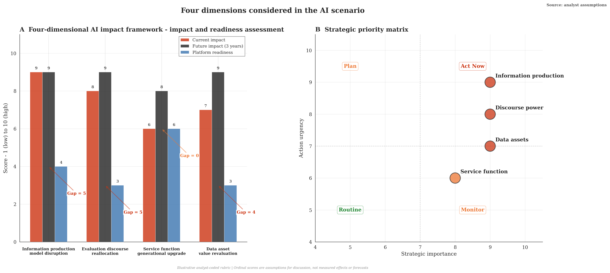

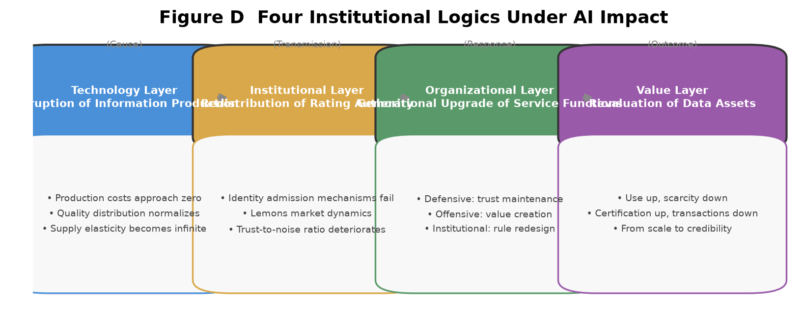

Technology layer: generative systems reduce the time and expertise required to produce review-like text. Production cost becomes a weaker implicit signal of human effort and experience. A longitudinal corpus with documented provenance is needed to estimate the resulting change in volume, style, and quality distribution on AOTY or RYM.

Institution layer: platforms decide who may contribute, how contributions are weighted, and what provenance information is visible. Generative tools increase uncertainty within rules originally designed around human accounts and bounded production capacity. Governance now covers content quality, origin, contribution weight, protection of legitimate users, and review of disputed decisions.

Platforms with extensive historical reviews and taxonomies have more accumulated information at stake when the provenance of new contributions becomes uncertain. This exposure may coexist with stronger community controls and contribution histories. Comparative trust and retention data are needed to determine which force dominates.

Organization layer: linguistic or behavioral screening, human review, rate limits, contribution histories, disclosure rules, and appeals address different parts of the problem. Detection alone targets textual or behavioral symptoms. Provenance policy and ranking design address how uncertain contributions enter the information system. Both require validation, resources, privacy safeguards, and accountable review.

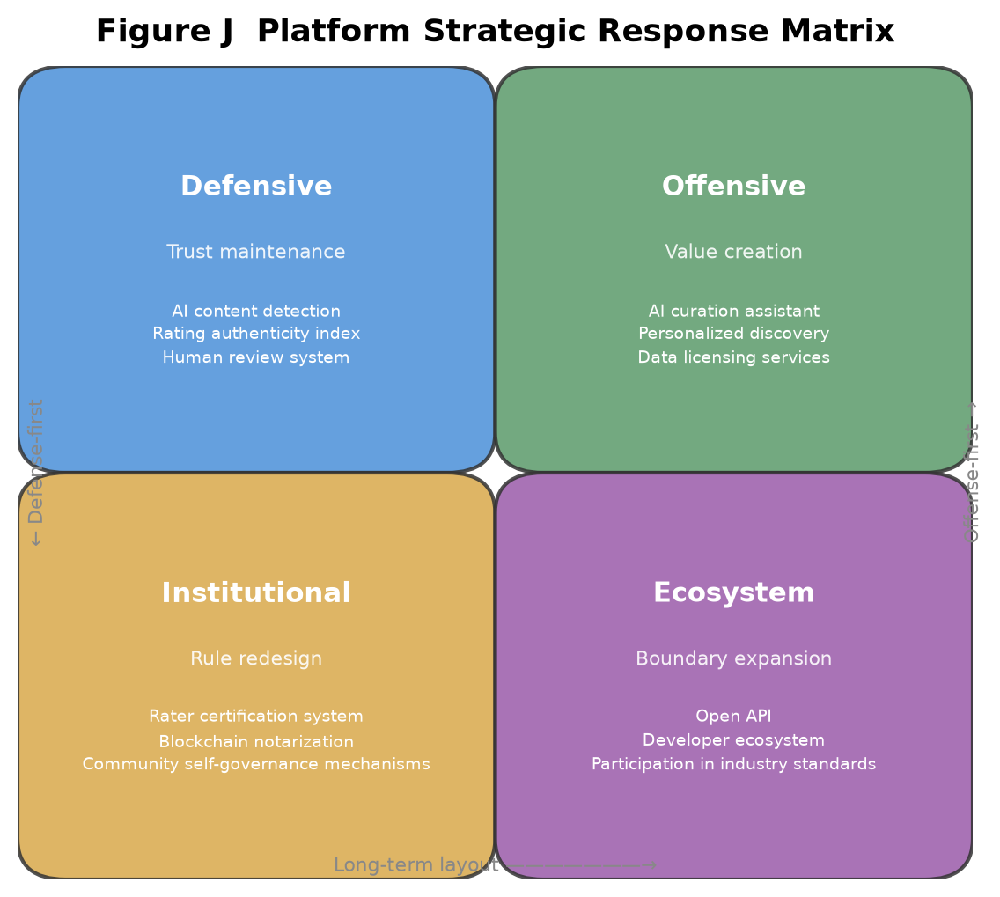

Advertising and subscriptions often reward traffic and activity. Review quality may receive less attention when it is difficult to measure. This possible incentive problem should be checked against each platform's actual revenue model, moderation policy, and product metrics.

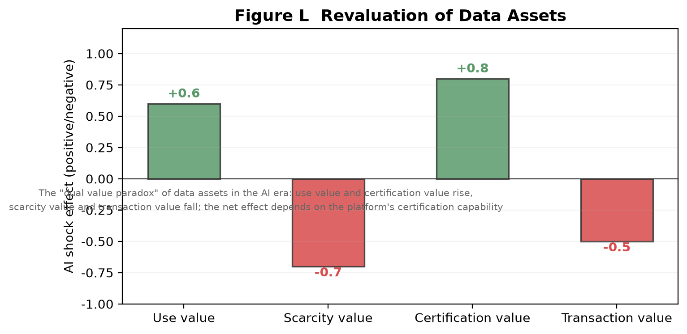

Value layer: the worth of evaluation data depends on scale, coverage, taxonomy, and production history. Generative AI makes the final element more salient because textual plausibility supplies less information about origin. This produces a data-value proposition that can be tested: users and licensees may place greater weight on documented moderation, stable field definitions, and contribution provenance as generation costs fall. The project does not estimate a market premium.

Data scale remains useful, but users and licensees may also ask how records were produced and moderated. Platforms can improve provenance and disclose uncertainty without promising perfect proof of human authorship. The commercial effect of those measures has not been measured here.

### 2.3 Strategic Options under Current Conditions

The preceding analysis yields three strategic propositions. Platform governance should treat provenance and ranking as part of the information product, because text classification cannot resolve contribution history or rating weight. Core contributors deserve separate monitoring because aggregate traffic can remain stable while detailed reviews and taxonomy work decline. Platform responses should also reflect the source of value: a database-centered service, a socially oriented rating platform, and a transaction platform face different consequences from the same increase in low-cost content.

These propositions require evidence on manipulation, review use, contributor retention, moderation outcomes, and user trust. Legal requirements also differ by jurisdiction, service, and date. Platforms can document provenance, appeals, ranking changes, and moderation decisions as part of ordinary governance, with product-specific legal analysis determining compliance duties.

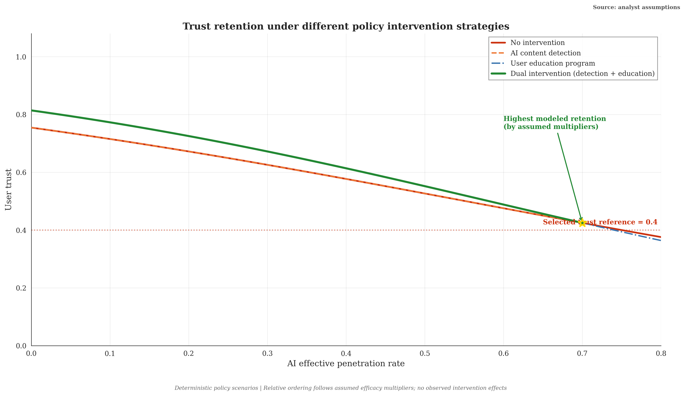

## III. Market and Competitive Landscape Analysis

The market and competition section describes platform positions, the assumptions behind them, and factors that may change those positions. It then considers RYM, AOTY, and Douban Music in more detail.

### 3.1 Market Structure

#### 3.1.1 Product Categories and Growth Drivers

The report distinguishes five categories of music information service according to their primary product and source of user value. These categories are analytical groupings; they are not estimated market segments.

No sourced revenue series exists here for UGC music-evaluation platforms. Demand can be studied through observable behavior such as rating volume, review production, chart use, repeat contribution, referrals, and subscription conversion. User research could test whether uncertainty about provenance reduces reliance on aggregated judgments.

Professional criticism uses bylines, editors, and publication records that help readers judge provenance. Its business performance and response to generative AI vary by publication. This report has no comparable revenue series across publications.

Music databases and data licensing face two opposing pressures. AI development can increase demand for structured metadata, taxonomies, and evaluative labels. Cheap generated records can lower confidence in datasets whose origins are unclear. No separate revenue total is available here. Buyer research should test willingness to pay for known provenance, stable definitions, and documented quality controls.

On Discogs and Bandcamp, purchases and catalog information play a larger role than ratings alone. Reviews can still affect discovery and perceived value, so manipulation remains relevant. The project does not estimate revenue or growth for this category.

Playlist creation has low copying and switching costs, and automated recommendation can compete with some forms of human curation. The project does not measure substitution, market size, or growth for this category.

No defensible aggregate market size for music-rating and review platforms is available in the sources used here. Strategic comparison rests on business-model exposure: ratings depend on contribution integrity, editorial products depend on bylines and commissioning, transaction platforms can verify some behavior through purchases, and streaming platforms anchor value in playback and recommendation.

#### 3.1.2 Genre-Level Participation

The genre comparison uses the 2024 AOTY high-rated snapshot and the 2022 RYM popular snapshot. It retains the twelve shared genres with the strongest minimum coverage across both sources, then compares median scores, rating counts, RYM review density, and sample coverage.

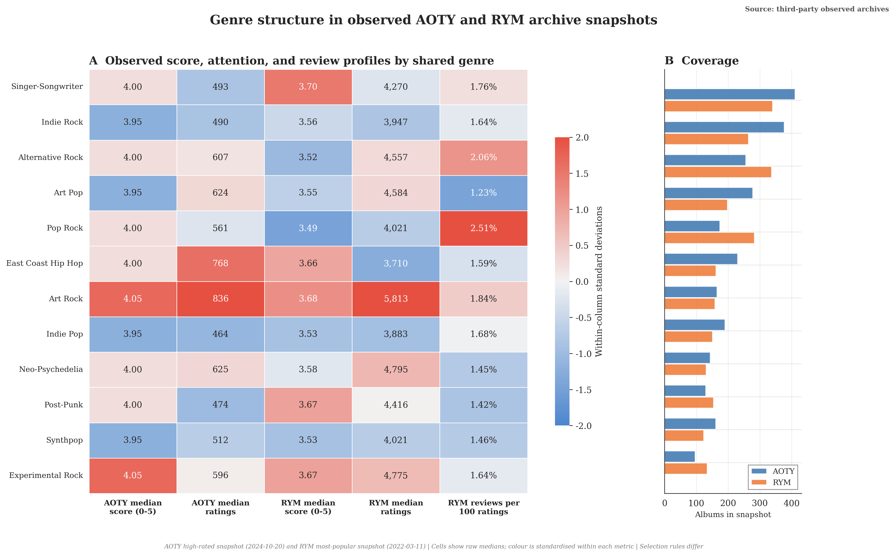

The observed pattern varies across metrics. Art Rock and Experimental Rock sit near the top of both score columns, while Art Rock also carries the highest median rating count among the displayed genres on both platforms. Pop Rock has the highest RYM review density at 2.51 reviews per 100 ratings, more than twice Art Pop's 1.23. Genre affects the amount and form of participation; one ordinal sensitivity score would conceal that variation.

Genre can serve as a sampling stratum in the next stage. Detector accuracy, review depth, and contributor retention should be estimated within genres before results are pooled. A model that performs well on polished Art Pop criticism may fail on short Hip Hop reactions or technical Metal reviews.

The heatmap reports observed medians and album counts. Colour is standardized within each metric so that unlike units can be read together; the printed cell values remain on their original scales. The AOTY file is high-rating-selected and the RYM file is popularity-selected. The figure describes their genre structure and makes no claim about post-2022 change.

### 3.2 Potential Changes in the Competitive Landscape

#### 3.2.1 Analyst-Coded Platform Positioning and AI-Related Exposure

The scenario places platforms on two selected dimensions: data depth and social experience. The resulting groups are descriptive and depend on analyst-assigned scores.

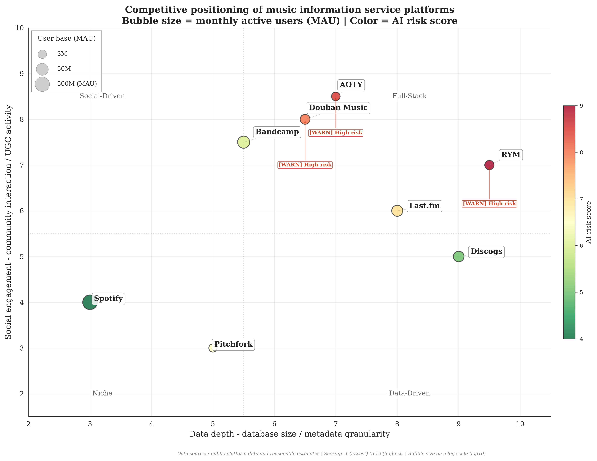

The scenario gives the crowdsourced-knowledge type its highest vulnerability. RYM relies on ratings, reviews, and classifications, so coordinated or generated contributions are directly relevant to information quality. The 9.5 data-barrier and 8.5 community-barrier values are analyst scores. The observed archive supports the descriptive claim of data depth; the risk ranking and the value of additional provenance controls remain conditional.

The crowdsourced social type, represented here by AOTY, may have a lower vulnerability than a crowdsourced knowledge platform when social participation gives users additional reasons to stay. The 35% difference shown in the scenario comes from an analyst-selected social-stickiness multiplier. It should be read as a comparison of assumptions, not a measured platform effect.

The scenario assigns medium review-related vulnerability to professional publications such as Pitchfork and Rolling Stone. Bylines and editorial responsibility provide provenance information that anonymous posts may lack. Comparative reader-trust and subscription data would be needed to determine whether this produces greater resilience.

The scenario assigns lower review-related vulnerability to Discogs and Bandcamp because transactions and catalog records contribute to their value. Purchase history does not verify the quality of a review, and generated or coordinated content may still affect discovery. The lower score is a model assumption. The platform outcome remains unmeasured.

The scenario assigns lower review-related vulnerability to Spotify and Apple Music because listening and recommendation are central to their products. This does not cover other AI risks, such as catalog fraud, recommendation manipulation, or generated music at scale.

The ranking follows one simple assumption: dependence on anonymous ratings increases exposure to rating manipulation. Spotify and RYM have different core products, so the relevant risks and controls also differ. The analyst-coded scores should not be read as measured safety levels.

#### 3.2.2 Data Assets, Community Participation, and Entry

The repository has no traffic, revenue, or user-share series from which to calculate market concentration. Competitive position is assessed qualitatively through product dependence on ratings, reviews, transactions, editorial authority, and playback. A concentration estimate will require a defined market boundary and comparable platform shares from the same period.

The value of a platform dataset depends on scale, quality, documentation, and access terms. This report has not verified RYM's current catalog size or licensing policy. A later comparison should use current platform disclosures and distinguish metadata from ratings, reviews, and user-created lists.

Community value depends partly on relationships, contribution histories, and confidence in platform rules. Doubts about provenance may affect participation, especially among users who invest heavily in reviews or taxonomy work. The direction and size of that effect remain unmeasured; contributor retention and exit should be studied directly.

Years of accumulated ratings, reviews, and taxonomy decisions are costly to reproduce, and the RYM archive makes part of that depth visible. Longevity does not establish the provenance of each new contribution. A dated panel is needed to measure whether contribution patterns or user reliance change over time.

New entrants can design provenance and moderation controls at launch. Existing platforms must account for old data, established user habits, privacy, and compatibility. New services still face the harder task of attracting contributors and building a useful catalog.

Entrants lack the history, contributors, and taxonomy of established platforms. The report has no market-entry data and makes no forecast about a new market leader. A focused service may still be worth studying as a case.

### 3.3 Platform Case Analysis

This section applies the preceding framework to RYM, AOTY, and Douban Music. The comparisons identify questions for further research and do not forecast platform outcomes.

#### 3.3.1 RYM: Data Depth and Governance Constraints

RYM is the clearest data-centered case in this comparison. The observed archive covers only 5,000 popular albums, yet those rows already contain more than 30 million ratings, 506,510 reviews, dense genre labels, and descriptors. The project has no verified count for RYM's full catalog, subgenres, or user charts. Accumulated structure is valuable, and its credibility has to be maintained record by record.

RYM's long history gives it valuable data, but the platform also needs clear provenance and moderation practices. Stronger verification may add cost and friction, and the likely return is unknown. The choice should be evaluated through user research and small trials.

RYM's detailed taxonomy is another asset. Its value comes partly from the definitions and discussion behind the labels. Licensing, standards work, or data services are possible directions, but this report has no evidence on demand, pricing, or margins.

Possible constraints include implementation resources, community acceptance, privacy, and the compatibility of new provenance controls with established records. The project has no verified staffing, budget, user-attitude, or buyer-demand data for RYM. Assessing these factors requires platform documentation, interviews, and controlled trials.

The scenario assigns RYM an AI-response-readiness score of 4/10. This value is an analyst judgment and has not been validated against platform staffing, moderation outcomes, policy implementation, or detector performance. It should not be interpreted as a measured readiness score.

#### 3.3.2 AOTY: Social Participation and Governance Constraints

AOTY and RYM differ in the prominence they give to database functions, ratings, lists, profiles, and social participation. The available archives describe selected content and activity; they do not determine how either platform will respond to generative AI.

AOTY combines ratings with lists, profiles, and discussion. These features may give users reasons to stay when they question some ratings. The retention effect and feature-use shares have not been measured.

The trust scenario illustrates this judgment by assigning a slower decline to platforms with stronger social participation. That setting is an input assumption, so the model does not establish that AOTY has a longer adjustment window than RYM.

AOTY's social functions may give users reasons to stay during a ratings dispute, though the project has no retention data to measure that effect. The risk can be stated without a forecast: if users separate social activity from information seeking, traffic may remain while ratings lose authority. AOTY's move toward weighted charts suggests that score credibility and low-count distortions already receive product attention. Measuring return visits, review depth, and chart use would show whether social participation buffers information loss.

The scenario assigns AOTY an AI-response-readiness score of 3/10. The score is not based on verified technical capacity, staffing, or governance outcomes. Lightweight provenance disclosure, behavioral monitoring, and human review are options worth testing, but the project does not establish which intervention fits AOTY's organization or users.

#### 3.3.3 Douban Music: Potential Structural Vulnerabilities

The analyst-coded scenario assigns Douban Music the highest composite vulnerability among the platforms compared. The score reflects selected assumptions and cannot be generalized to Chinese-language music platforms.

Douban Music operates under a different language, regulatory, and platform environment. This repository contains no comparable Douban catalog, activity, staffing, or moderation dataset. A defensible comparison would measure Chinese-language catalog coverage, active contributors, review depth, moderation turnaround, and compliance responsibilities under China's generative-AI and synthetic-content rules.

One possible mechanism links catalog coverage, participation, revenue, and investment in moderation. The repository contains no longitudinal Douban data with which to estimate these relationships or determine whether generative AI has accelerated them.

China, the European Union, and the United States use different regulatory approaches to generated content and platform responsibility. This report does not conduct a comparative legal analysis and makes no ranking of regulatory strictness or platform compliance exposure.

Douban Music could emphasize Chinese-language independent music and local cultural context. The claim that AI performs worse on this material is untested here and would require a multilingual evaluation dataset.

#### 3.3.4 Cross-Case Comparison

The cross-case comparison produces three propositions about structural exposure.

Proposition 1: accumulated data depth raises both the value protected by governance and the cost of changing established rules. RYM illustrates this condition through its ratings, reviews, and taxonomy. The current readiness scores organize the proposition and provide no statistical test.

Proposition 2: social participation may preserve visits and interaction while confidence in ratings changes. AOTY illustrates a possible separation between platform retention and information authority. Testing this proposition requires feature-level use, repeat visits, review production, and trust measures.

Proposition 3: language, regulation, catalog coverage, and community history shape the feasible governance response. Douban Music cannot be placed on the same empirical scale without comparable Chinese-language platform data. The three propositions replace a single universal vulnerability ranking with platform-specific mechanisms that can be measured in later work.

At the level of analytical diagnosis, the three cases point to different possible crisis forms: an institutional crisis for RYM, whose accumulated value depends on the credibility of ratings, reviews, and taxonomy; a positioning crisis for AOTY, where social retention may diverge from informational authority; and a viability crisis for Douban Music, where language, catalog, community, and regulatory constraints may compound. These labels summarize mechanism-based exposure and do not constitute observed diagnoses of current platform decline.

# Part 2 Professional Application and Researcher Development

Part 2 translates the research process into professional-development considerations. It is not part of the empirical test reported in Part 1, and its claims about occupations or organizations require separate labor-market evidence.

## IV. Industry Employment Prospects and Talent Demand

### 4.1 Employment Opportunities and Challenges

#### 4.1.1 Changes in the Employment Structure

Generative AI is changing work in information services. Routine collection, tagging, and first-pass moderation can be automated, while content integrity, data governance, evaluation, and appeals still require judgment and clear accountability. The relevant career question is how much of a role depends on routine production and how much depends on investigation, policy, or communication.

Relevant roles include trust and safety analyst, content integrity analyst, policy operations specialist, data quality analyst, and AI evaluator. The present study does not contain labor-market data and cannot show that these roles are growing. Its contribution is narrower: it identifies platform problems that such roles may need to address and supplies a project through which the required analytical skills can be demonstrated.

At a broader level, employers may place more weight on source verification, audit trails, model evaluation, and policy implementation. The scale and direction of this change should be checked with job-posting data over time. For practitioners, a practical response is to build skills that transfer across platform governance, data analysis, and content operations.

#### 4.1.2 Employment Opportunities

The study did not collect a representative sample of vacancies, headcount, applicant supply, or salaries for 2025 to 2030. This section treats content integrity, platform governance, data quality, AI evaluation, and community operations as fields to investigate through current job postings and interviews, without numerical labor-market forecasts.

Without comparable salary and vacancy data, the report cannot infer a relationship between hiring demand and pay. A later study could code postings by location, seniority, required skills, and compensation, then compare content operations with technical evaluation and policy roles.

The project suggests a useful combination of skills: text analysis, statistical testing, platform policy, privacy, and clear reporting. Current vacancies and practitioner interviews should be used to test where employers seek that combination and how they name the work.

Chinese music information services operate under a distinct regulatory and platform context. The repository contains no verified investment comparison with overseas platforms. A defensible career assessment would compare dated job postings, team disclosures, and regulatory responsibilities across selected firms.

#### 4.1.3 Employment Challenges

Training-data annotation may face automation pressure, though the scale and timing vary by task and industry. The current project has no longitudinal detector benchmark and does not support a fall from 95% in 2023 to below 80% in 2025. Transferable work includes quality assurance, evaluation design, error analysis, and policy interpretation.

Job responsibilities can change as tools and organizations change. Practitioners benefit from learning new methods, recognizing when a role is narrowing, and carrying useful skills into adjacent fields. The report does not assume a fixed two-to-three-year cycle.

Another challenge is the amount of information these roles require. Practitioners may need to follow model changes, regulation, and community policy at the same time. A regular review schedule and clear source notes can make that workload manageable.

### 4.2 Talent Demand Trends

#### 4.2.1 Changes in Corporate Recruitment Preferences

This study did not collect a representative recruitment dataset, so it cannot claim a change in hiring preferences from 2024 to 2026. Current job postings should be reviewed before drawing that conclusion. For preparation purposes, candidates can still expect questions about data quality, abuse cases, policy trade-offs, and the evaluation of automated systems alongside standard technical and behavioral interviews.

Roles in platform governance often combine technical analysis with policy judgment. Useful abilities include anticipating abuse, connecting technical findings to platform rules, documenting uncertainty, and making decisions in disputed cases. These abilities develop through repeated case work and careful review.

A practical profile combines depth in one field, such as NLP or statistics, with working knowledge of community governance and data privacy. The report has no evidence that ten-review discrimination tests are common in hiring. A stronger portfolio would explain a dataset's provenance, evaluation design, errors, and limits in plain language.

#### 4.2.2 Emerging Roles

A content integrity analyst may review suspected manipulation, maintain detection rules, analyze model errors, and work with community or policy teams on disputed cases. Relevant skills include NLP, anomaly detection, Python, sampling, documentation, and careful escalation. The study has no reliable salary sample and no longitudinal detector benchmark, so it makes no salary or 2023-to-2025 performance claim.

A platform governance lead may design reputation rules, rating weights, moderation policy, appeals, and monitoring. The work draws on product design, policy, statistics, privacy, and system architecture. Seniority and pay vary sharply by market and organization, and no range is reported here without a dated vacancy sample.

A data quality or compliance auditor may review provenance controls, sampling procedures, model documentation, and adherence to policy. Relevant skills include audit methods, statistics, data analysis, and regulatory interpretation. Current postings are needed to establish demand and compensation; the model in this report cannot do so.

## V. Occupations and Competencies

### 5.1 Typical Roles and Development Paths

#### 5.1.1 Career Development Routes

One possible development route begins with data analysis, community operations, or content moderation. Later roles may include content integrity analyst, platform governance specialist, data quality auditor, governance lead, or independent consultant. Years of experience do not determine the route by themselves; demonstrated responsibility and the quality of prior work matter more.

This route combines technical depth with a gradual expansion into policy, operations, and business. The exact order depends on the role. Early work can focus on one area, while later responsibility often requires coordination across several teams.

#### 5.1.2 Comparison of Enterprise Types

Different enterprise types provide different career paths, team sizes, and promotion structures. Salary comparisons require postings matched by country, city, seniority, contract type, and reporting period; this project does not supply that dataset.

Company choice should consider role scope, manager quality, access to real problems, learning support, compensation, and stability. The report has no cross-company salary or promotion dataset, so it does not rank enterprise types on those outcomes.

#### 5.1.3 Job Substitution Risk Assessment

Automation exposure varies within each occupation. Routine queue handling, simple reporting, and standardized replies are easier to automate. Appeals, policy interpretation, causal analysis, incident response, and communication across teams still require substantial human judgment. The report does not have task-level employment data, so it does not assign numerical accuracy or categorical replacement-risk labels.

A useful task-level question is how often the work requires handling new abuse patterns, incomplete evidence, and policy conflicts. Roles with more open-ended investigation may be harder to automate fully. This is a practical screening question, not a new occupational metric or a prediction of long-term job value.

### 5.2 Essential Skills

#### 5.2.1 Skills for Platform Governance

The following checklist groups skills that may be useful in platform governance. It is a planning aid for this report and has not been validated as a competency model.

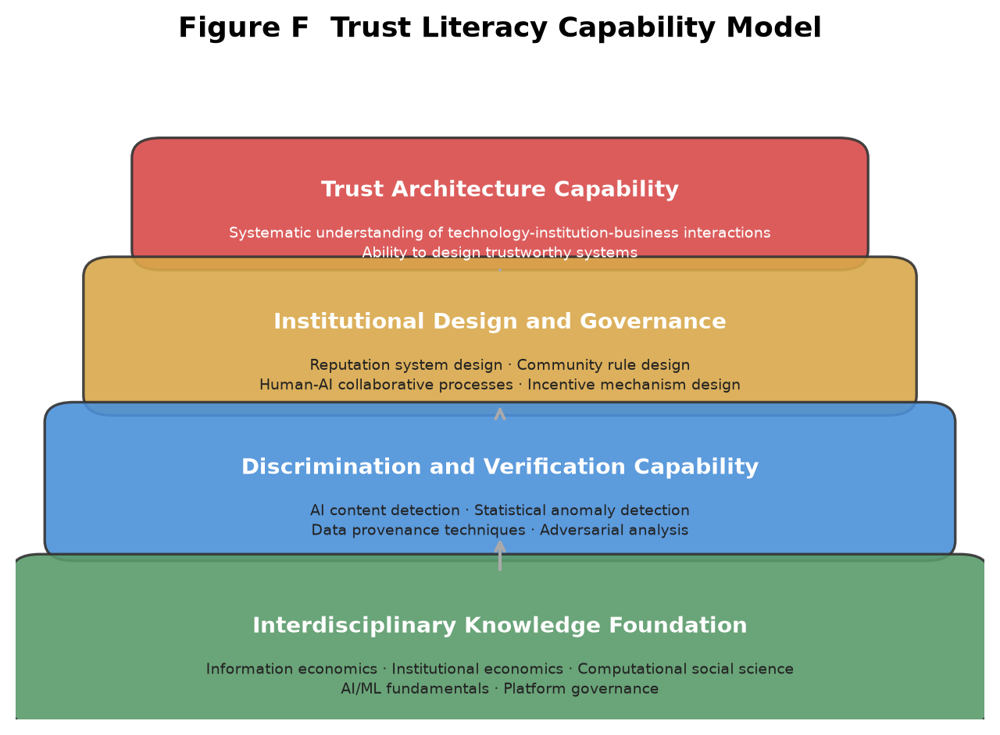

The foundation includes information economics, institutional analysis, computational social science, machine learning, and platform governance. These areas help practitioners examine incentives, rules, empirical patterns, automated systems, and moderation processes. The appropriate depth in each area depends on the role.

The second group covers verification: text classification, anomaly detection, data provenance, sampling, and abuse testing. Practitioners should understand detector errors and distinguish a statistical anomaly from evidence of manipulation. These tools need regular evaluation as data and models change.

The next group concerns institutional design and governance: reputation systems, community rules, human review of automated decisions, appeals, and contributor incentives. Some principles transfer across platforms, but their implementation depends on the product, user population, legal setting, and abuse patterns.

The fourth group covers strategy and communication. It includes tracing how a technical decision affects users and policy, anticipating abuse, balancing accuracy with privacy, explaining findings to different teams, and revising rules when evidence changes.

These skills improve through case work, review, and feedback. Compensation needs to be checked against current postings.

#### 5.2.2 Communication and Judgment Skills

Relevant professional skills include critical evaluation of automated output, ethical reasoning, cross-cultural analysis, clear communication, and conflict mediation. These skills are useful when evidence is incomplete, stakeholders disagree, or a technical metric does not resolve a policy decision.

These skills matter when a case involves competing interests, incomplete evidence, or an appeal. Automated tools can assist with factual checks, while accountable people still need to review policy and consequences.

## VI. Personal Career Planning and Job Search Strategies

### 6.1 Competitiveness Enhancement

#### 6.1.1 The Three-Year Competency Improvement Plan

The first year builds foundations in information economics, statistics, text analysis, and platform governance. A workable sequence is to write reading notes on Akerlof, Spence, and related research; reproduce a text-classification paper; observe governance in an open community; and publish a small project with clear data provenance and limitations.

The order can change with available courses and internships. Each activity should leave a concrete record: notes, code, an observation log, or a short report. That record makes progress easier to review and discuss in applications.

The second year can move from study to contribution. Possible activities include applying the institutional frameworks of North [3] and Ostrom [8] to a documented platform case, completing an adversarial machine-learning project, gaining supervised experience in platform governance, and developing a conference paper from a research question supported by appropriate data. The schedule should follow available opportunities and research readiness.

The second year should produce work that other people can inspect: an internship report, a reproduced study, a dataset note, or a paper. Claims should stay within the collected evidence. A small, careful study is more useful than a broad report with unsupported numbers.

The third year focuses on public work and applications. Useful steps include presenting a project, contributing to a governance or evaluation discussion, maintaining a technical blog, and applying for content integrity, platform governance, data quality, or AI evaluation roles.

By the third year, the goal is to have several pieces of work that can be reviewed by employers and peers. Projects, internships, writing, and presentations provide concrete evidence of ability.

#### 6.1.2 Internship and Project Selection

Trust and safety, content integrity, and community-governance teams are relevant places to seek practical experience. Internship availability, team names, and responsibilities change and should be checked through current official postings. Useful work may include data-quality review, policy analysis, abuse investigation, evaluation design, or documentation; access to sensitive moderation decisions will vary by organization.

Trust and safety, content integrity, and algorithm-governance teams at larger technology companies are another direction. They may offer experience with mature tools and large datasets, though intern responsibilities vary by team. Claims about team scope or daily processing volume should be checked against current company disclosures before use.

Research institutions and think tanks may suit people interested in academic or policy work. Internship availability and team names change, so applicants should check current official listings. These roles can build research and policy experience, while the amount of direct platform work varies.

Consulting and audit firms may provide experience in risk assessment, governance documentation, and communication with clients. The availability and substance of AI-governance work should be confirmed from current role descriptions and practitioner interviews.

For personal projects, topic selection is more important than technology selection. First clarify the trust problem you want to solve (for example, "how can a platform distinguish high-quality human evaluations from AI evaluations without requiring real-name registration"), then choose the technical means. The project should have a clear structure of cause, process, result, and reflection, so that anyone who sees it can quickly judge the quality of your thinking. Explaining the blind spots of the system, how attackers might bypass it, and the non-technical obstacles that may be encountered in deployment in the project documentation — these thoughts reflect the candidate's maturity better than the technical implementation itself.

#### 6.1.3 Professional Network Building

Professional relationships can develop through substantive participation in research and practitioner communities, contributions to open-source code or documentation, and careful communication with authors and peers. Public research notes should distinguish observation, interpretation, and evidence.

Professional networking works best when it is tied to useful work. Publishing careful analysis, contributing documentation, and asking informed questions give other people a concrete basis for judging your work.

### 6.2 Job Search Actions

#### 6.2.1 Target Company Selection

When selecting target companies, the differences among the five types of platforms need to be evaluated in specific contexts.

UGC platforms can provide direct exposure to rating integrity, community rules, and moderation. Team size, training, compensation, and promotion prospects vary widely and should be checked from vacancies and interviews. Learning speed should be judged from the responsibilities offered, not from a fixed conversion between employers.

Large technology platforms may offer mature engineering systems and specialized teams. The scale and status of governance work differ across companies, and the report has no comparative evidence on pay, promotion, or layoff risk. Applicants should ask about team ownership, review processes, and the scope of the role.

Professional publications offer experience with editorial provenance, commissioning, and criticism. Their technical roles, compensation, and employment prospects vary by publication and location; this project does not provide comparative labor-market data.

Specialized AI-governance and generated-text-detection firms may offer focused technical work. Their business models, funding, role stability, and evaluation practices vary. Applicants should assess current responsibilities, validation standards, and organizational risk from direct evidence.

Consulting and audit firms may offer work across several industries. The balance between advice and implementation varies by engagement, so applicants should check the actual responsibilities of each role.

When comparing offers, weigh learning, stability, compensation, role scope, and the quality of supervision. The importance of each factor depends on the individual's current needs.

#### 6.2.2 Interview Preparation

Interviews for governance and integrity roles may assess technical analysis, problem framing, policy judgment, documentation, and communication. The balance among these components varies by employer, and current vacancy and interview evidence should guide preparation.

A typical interview question: if RYM suddenly receives 1 million AI-generated fake ratings next month, how would you design a response plan? The answer can be developed from the three dimensions of technology, institutions, and business. The technical level includes deploying anomaly detection based on behavior patterns (timestamp distribution, IP sources, rating patterns), conducting text feature analysis of suspicious content (lexical diversity, emotional variance, specificity indicators), and automatically marking clearly identifiable AI ratings as uncertified ratings. The institutional level includes temporarily freezing the rating weight of newly registered users (introducing a waiting period system), publicly disclosing the details of the attack and the response strategy, and inviting senior users to participate in a trust jury. The business level includes proactively explaining the situation to users, making certified ratings part of value-added services, and repricing the value of certified data.

This question has no standard answer, and the incident scenario itself is highly uncertain. What the interviewer evaluates is the candidate's structured thinking ability: whether they can decompose a vague problem into actionable sub-problems, whether they can establish connections between technology and institutions, and whether they can anticipate the attacker's response strategy in the solution design.

#### 6.2.3 Job Application Materials

The resume can cover governance or moderation experience, technical work in statistics or NLP, and published analysis. Each claim should name the dataset and evaluation design. For this project, an accurate description would say that the classifier was tested on a 30-example controlled corpus and has no external validation; it should not claim a finding about RYM reviews.

The cover letter should use a specific, truthful example from study, work, or a documented project. It can explain how the problem was investigated, what remained uncertain, and why the target team's work is relevant. Do not invent an encounter with AI reviews or imply access to platform data that was never collected.

The portfolio should show how a question developed across several pieces of work. For each project, include the source material, method, result, limitation, and next step. This gives reviewers enough detail to assess the quality of the work.

### 6.3 Personal Positioning and Development

#### 6.3.1 The Three Stages of Long-Term Development

Stage one (years 1 to 3) focuses on analysis and evaluation. Suitable roles include data analyst, content integrity analyst, and junior data scientist. A useful milestone is completing an end-to-end project with documented data, evaluation, and error analysis.

Stage two (years 3 to 7) adds responsibility for platform rules and operations. A platform governance lead may coordinate product, policy, engineering, and community teams and may lead work on reputation or appeals systems. Progress should be judged by actual responsibility and outcomes, since fixed year ranges do not fit every organization.

Stage three (years 7 to 15) may include governance leadership, standards work, policy, or independent consulting. A relevant milestone is contributing to a documented industry standard, audit method, or regulatory process.

#### 6.3.2 Path Selection

One path is to develop governance expertise within an established organization. Another is to join or create a specialized service. Their risks and returns depend on the organization, market, and individual circumstances; the report does not assign general risk categories or expected returns.

The choice between these paths depends on risk tolerance, financial needs, and interest in the work. A role with transferable analysis and governance skills leaves more options open if the field changes.

## VII. Career Development Risks and Responses

### 7.1 Risk Identification

#### 7.1.1 Industry-Level Risks

New language models may reduce the usefulness of existing text detectors. The timing and size of that risk are unknown. This study has no longitudinal benchmark and does not verify an 8-to-12-point decline from 2023 to 2025. A practical response is to evaluate models regularly on dated external samples and avoid relying on one detector.

Platforms may choose automated ranking and moderation systems that reduce demand for some governance tasks. The project has no basis for a probability or three-to-five-year forecast. Practitioners can reduce exposure by building skills in evaluation, appeals, policy, and data quality.

Market concentration could reduce roles at independent evaluation platforms if users and revenue move elsewhere. The project does not estimate the probability or timing. Skills in evaluation, policy, data quality, and communication can transfer to streaming, marketplaces, social platforms, research, and audit.

Policy changes can alter documentation, labeling, and moderation responsibilities. The project contains no basis for assigning a probability, impact score, or one-to-five-year horizon. Practitioners should monitor the jurisdictions and services relevant to their work and obtain product-specific legal advice when needed.

#### 7.1.2 Individual-Level Risks

A narrow dependence on one detector or model can become a risk when tools change. Review skills periodically and keep experience in statistics, evaluation, policy, and communication alongside tool-specific knowledge.

Job titles vary across companies. Similar work may appear under trust and safety, content integrity, platform governance, data quality, policy operations, or AI evaluation. Applicants should search by responsibilities and show evidence of relevant work.

Employment at a large platform does not remove organizational risk. The report has no comparative layoff data for trust teams. Maintaining transferable skills, public work, and professional relationships can reduce dependence on one organization or technology stack.

Commercial metrics may conflict with content-integrity goals. Practitioners should document risks, identify affected users, explain trade-offs, and use formal escalation channels. Claims about the long-term commercial value of authenticity require organizational or market evidence.

### 7.2 Response Strategies

#### 7.2.1 Improving Career Adaptability

A practical allocation is to keep most time on work that compounds through repeated use, while reserving a smaller fixed block for research, writing, or an independent project. The exact ratio should follow workload and finances. One adjacent skill, such as network analysis or data visualization, is enough when it produces finished work and does not become another unfinished curriculum.

Professional reputation, working relationships, institutional knowledge, and a documented case record can support later work. Their value is context-dependent and may change with technologies and organizations. Regular publication and reflection make those capabilities easier for collaborators and employers to assess.

Researchers and practitioners may need to connect several levels of analysis. Technical questions include detector error rates; institutional questions concern rules, appeals, and user responses; organizational questions concern resources and accountability. Moving among these levels can reveal assumptions that remain hidden in a single technical or strategic analysis.

#### 7.2.2 Crisis Response

When a platform detects a large volume of suspicious contributions, the response should follow a documented incident process. Relevant steps include preserving evidence, estimating scope, protecting unaffected users, reviewing automated decisions, communicating verified facts, and monitoring recovery. The appropriate timeline depends on severity and platform capacity; the project does not establish a two-to-four-week window.

When external evaluation shows that a detector is losing accuracy, review the data, failure modes, and role of human appeal before changing tools. The report provides no basis for a fixed three-to-six-month career deadline.

When an organization changes its governance strategy, practitioners should assess how the change affects their responsibilities, ethical constraints, and opportunities to do useful work. Career decisions require more evidence than a single product announcement, and no fixed response window is proposed here.

When regulation changes, practitioners can help translate legal and policy requirements into documented product and operational decisions. This work should involve qualified legal, policy, technical, and user-protection expertise. The report makes no claim about short-term bargaining power.

When opportunities narrow in one platform category, describe experience through transferable responsibilities such as data quality, moderation, evaluation, policy, and incident response. Review options early, without attaching the plan to an unsupported six-to-twelve-month deadline.

#### 7.2.3 Learning Strategies

A useful learning plan combines structured study with problem-led practice. Core methods should be reviewed as tools and research standards change. Papers, books, code, documentation, and practitioner discussions serve different purposes and should be evaluated according to their evidential value.

Possible resources include peer-reviewed work from CSCW, CHI, FAccT, and related venues; preprints on text provenance and platform governance; technical documentation; and practitioner publications. A sustainable schedule might combine close reading with replication, a small empirical exercise, or a critical research note. Frequency should follow available time and the quality of the selected material.

# Part 3 Summary

## VIII. Conclusions and Recommendations

### 8.1 Conclusions

Conclusion 1: generative AI creates a structural pressure on crowdsourced evaluation by reducing the cost of producing review-like text and weakening production effort as an implicit signal of provenance. The governance problem expands from judging content quality to documenting contribution history, assigning rating weight, protecting legitimate contributors, and preserving confidence in accumulated data. This is the study's central theoretical proposition. The current evidence does not estimate the magnitude of the effect on AOTY or RYM.

Conclusion 2: the selected RYM and AOTY archives show strong score agreement. Across 4,102 exact album matches, user scores correlate at 0.910 and 87.4% differ by no more than half a point on a common 0-5 scale. This shared evaluative order is the clearest empirical result in the project. It also identifies what could be lost if users cease to trust how scores are produced and weighted. The differently dated archives do not establish stable agreement over time.

Conclusion 3: attention and written participation are unevenly distributed within the selected archives. The AOTY high-rated snapshot has a rating-count Gini coefficient of 0.617, while the RYM popular snapshot has a coefficient of 0.400; the top 1% account for 12.3% and 6.8% of represented ratings, respectively. The different selection rules prevent a direct platform-level comparison. Within the RYM snapshot, the median written-review share is 1.65%. A small group of written contributors may carry substantial interpretive and classificatory work even when ratings remain abundant.

Conclusion 4: the text-classification exercise is a controlled stylistic comparison. Five-fold out-of-fold evaluation on 15 published critic excerpts and 15 manually authored assistant-style controls produced 96.7% accuracy and an AUC of 0.996. The result shows separation between these two constructed groups. It does not estimate AI-text detection performance. A production evaluation requires platform-native human reviews, documented outputs from multiple models and prompts, unseen artists, and external validation.

Conclusion 5: a post-2022 structural break remains unproven. The Chow, CUSUM, and Bai-Perron-style procedures recover the known break in the synthetic benchmark, which verifies implementation. The available archives are cross-sections and cannot measure when ratings were cast. Dated repeated snapshots remain necessary to estimate whether generative AI coincided with changes in rating distributions, review depth, contributor activity, or trust.

Conclusion 6: ranking design and provenance policy have become central components of platform governance under conditions of inexpensive content generation. AOTY moved genre, critic, and user charts toward weighted scores and added user-level CSV export between October 2025 and July 2026. These changes do not establish an AI response. They show that count thresholds, weighting, and portability are active institutional choices. The broader implication is testable: platform advantage may increasingly depend on the credibility of contribution histories and governance records alongside the scale of accumulated data.

### 8.2 Industry Strategic Recommendations

Platforms should treat trust as a product function with owners, metrics, and release criteria. Rating charts need visible weighting rules, contribution histories, anomaly monitoring, appeal paths, and change logs. Data exports should carry field definitions and provenance notes. These measures strengthen the value of accumulated data without promising perfect proof of human authorship. Revenue claims about certification or licensing should wait for buyer evidence.

The first operational priority is contribution integrity. Combine account age, rate limits, timing patterns, rating dispersion, review history, and coordinated-behavior signals; publish what affects weighting; give users a path to challenge enforcement. Linguistic detection can inform triage and should not decide authorship by itself. The archive results support this emphasis because a small written-review layer sits above millions of ratings, making false positives against serious contributors costly.

Platforms could evaluate a minimum provenance vocabulary covering account-age bands, edit history, moderation status, source type, rating-weight policy, and machine-assistance disclosure. C2PA offers provenance principles for digital media, though it does not certify that a music review reflects a human judgment. The costs and user effects of a cross-platform schema should be tested before adoption.

Platform governance should begin before a moderation incident. Waiting periods, graduated rating weight, burst controls, transparent minimum-count rules, and review queues can reduce damage before removal is required. Community rules should distinguish disclosed assistance, undisclosed generated reviews, coordinated rating campaigns, and ordinary disagreement. The policy needs proportional sanctions and an appeal record that can be audited.

### 8.3 Recommendations for Practitioners

Build a working knowledge of technology, platform rules, incentives, and business constraints. Course and project choices should connect these areas to a concrete governance problem.

Build a T-shaped capability structure. Have sufficient depth in one technical field (NLP, text analysis, recommendation systems), at least being able to independently complete one end-to-end project. At the same time, possess an interdisciplinary perspective of institutional economics, platform governance, and data ethics. The value of the T-shaped structure is that depth provides the entry qualification, and breadth provides risk resistance.

Use projects to show problem framing, evidence handling, implementation, and trade-offs. Include abuse cases and explain how the design could fail.

Publish careful work and participate in relevant technical, policy, or research communities. Public work gives employers and collaborators evidence of judgment and communication. Its value depends on quality and consistency, so no return rate is assumed here.

# Part 4 Appendices

## Appendix A Detailed Tables of Research Data and Statistical Analysis

### A.1 Observed Archive Statistics

| Statistic | AOTY archive/snapshot | RYM snapshot | Cross-platform | Interpretation |
| --- | --- | --- | --- | --- |
| Album records | 32,358 historical + 5,000 high-rated | 5,000 popular | 4,102 exact matches | Selected cross-sections |
| Ratings represented in top-5,000 file | 6,277,268 | 30,418,504 | - | Sample totals; not platform totals |
| Median ratings per album | 482 | 3,973 | - | Selection rules differ |
| Top 1% share of represented ratings | 12.29% | 6.80% | - | Within-sample concentration |
| Rating-count Gini coefficient | 0.617 | 0.400 | - | Within-sample inequality |
| Median written-review share | Not available | 1.65% | - | Reviews divided by ratings |
| User-score agreement | - | - | Pearson r = 0.910; Spearman rho = 0.836 | Exact artist-title-year matches |
| Score calibration | - | - | 87.4% within 0.5; median AOTY-RYM = +0.34 | Both scores rescaled to 0-5 |

### A.2 Synthetic Structural-Break Method Check

| Test method | Detected breakpoint | Confidence interval (95%) | Statistic | p value |
| --- | --- | --- | --- | --- |
| Bai-Perron-style segmentation | November 2022 | Synthetic target window | Least-squares/BIC result | Recompute on empirical panel |
| Descriptive CUSUM | December 2022 | — | Detrended residual path | Permutation-bootstrap inference |
| Regression Chow test (split at 2022.11) | November 2022 | — | Split-versus-pooled regression F | Recompute on empirical panel |

### A.3 Controlled Text-Classification Performance

| Component | N | Source | Evaluation | Main result | Boundary |
| --- | --- | --- | --- | --- | --- |
| TF-IDF + Random Forest | 30 | Combined corpus | 5-fold out-of-fold | Accuracy 96.7%; AUC 0.996 | Distinguishes the two constructed groups; no external validation |
| Critic excerpts | 15 | Published critic excerpts in AOTY/Metacritic archive | Deterministic source-diverse sample | Observed text | Professional critics; no platform-user sample |
| Assistant-style controls | 15 | Manually authored controls | Fixed benchmark | Controlled text | Not generated by a documented model; no prompt diversity |
| Intended use | - | - | Feature and pipeline check | Demonstration only | No prevalence estimate |

### A.4 Linguistic Features in the Controlled Corpus

| Rank | Feature | Critic-excerpt mean | Assistant-style control mean | Standardized difference | Direction |
| --- | --- | --- | --- | --- | --- |
| 1 | Average sentence length | 22.778 | 12.922 | -1.26 | Higher in critic excerpts |
| 2 | Vocabulary diversity | 0.900 | 0.869 | -0.69 | Higher in critic excerpts |
| 3 | Filler-word count | 0.133 | 0.000 | -0.54 | Higher in critic excerpts |
| 4 | Emotional-word count | 0.000 | 0.133 | +0.54 | Higher in assistant-style controls |
| 5 | All-caps ratio | 0.001 | 0.000 | -0.37 | Higher in critic excerpts |
| 6 | Technical-term count | 0.133 | 0.267 | +0.33 | Higher in assistant-style controls |
| 7 | Contrastive-word count | 0.333 | 0.200 | -0.25 | Higher in critic excerpts |
| 8 | Number-reference count | 0.333 | 0.200 | -0.18 | Higher in critic excerpts |
| 9 | Sentence-length SD | 4.124 | 4.152 | +0.01 | Similar |
| 10 | First-person count | 0.000 | 0.000 | 0.00 | No difference in sample |
| 11 | Specific-reference count | 0.000 | 0.000 | 0.00 | Dictionary did not capture archive details |

### A.5 Assumed Trust Model Parameters

| Parameter | Meaning | Baseline value | Sensitivity range |
| --- | --- | --- | --- |
| α (alpha) | Preference intensity parameter | 0.7 | [0.4-0.9] |
| β (beta) | User discrimination ability | 2.0 | [0.5-5.0] |
| γ (gamma) | Network effect strength | 0.3 | [0.0-0.8] |
| τ (tau) | Trust threshold | 0.4 | [0.2-0.6] |

### A.6 Assumption-Driven User-Group Scenarios

| User type | Discrimination β | Preference α | Trust reference τ | Scenario crossing point | Assumed share |
| --- | --- | --- | --- | --- | --- |
| Veteran music fans (core contributors) | 4.0 | 0.85 | 0.55 | 30% | 5-10% |
| Active users (regular rating) | 2.5 | 0.75 | 0.50 | 45% | 20-30% |
| Ordinary users (occasional rating) | 1.2 | 0.65 | 0.45 | 62% | 40-50% |
| Casual browsers (rare participation) | 0.6 | 0.55 | 0.35 | 80% | 15-25% |

### A.7 Analyst-Coded Competitive Scenario Scores

| Platform | Data depth | Social experience | Technology barrier | Data barrier | Community barrier | AI risk | Composite vulnerability |
| --- | --- | --- | --- | --- | --- | --- | --- |
| RYM | 9.5 | 7.0 | 6.0 | 9.5 | 8.5 | 9.0 | 8.14 |
| AOTY | 7.0 | 8.5 | 5.5 | 7.0 | 8.0 | 8.5 | 7.57 |
| Pitchfork | 5.0 | 3.0 | 3.0 | 4.0 | 7.0 | 6.5 | 5.36 |
| Discogs | 9.0 | 5.0 | 5.0 | 9.0 | 7.0 | 5.0 | 5.07 |
| Bandcamp | 6.0 | 6.5 | 4.0 | 5.0 | 6.0 | 4.0 | 4.57 |
| Spotify | 3.0 | 4.0 | 8.0 | 6.0 | 3.0 | 4.0 | 3.86 |
| Apple Music | 3.0 | 3.0 | 7.0 | 5.0 | 2.0 | 3.5 | 3.36 |
| Douban Music | 6.5 | 7.0 | 3.0 | 6.5 | 7.0 | 8.0 | 5.60 |
| Last.fm | 8.0 | 5.0 | 4.0 | 8.0 | 5.0 | 6.0 | 5.50 |

## Appendix B Minutes of Community Discussions

The RYM forum file in this repository is synthetic. Its titles, topic labels, dates, and yearly counts were generated from templates. They cannot be described as forum archives or used to estimate changes in community attention. This appendix records the intended coding scheme for future collection: topic, date, reply count, sentiment, and moderation response.

No empirical sequence of community attitudes can be reported from the current file. A later analysis should publish the forum query, sampling dates, inclusion rules, deduplication procedure, and a reproducible annotation codebook before presenting sentiment percentages.

## Appendix C Methodology and Technical Route

The research design follows the proposed shift from content scarcity to provenance scarcity and the technology-institution-organization-value transmission framework. It combines descriptive archive analysis, a controlled text-classification exercise, synthetic method checks, and deterministic scenarios. The implemented methods are exact cross-platform entity matching, concentration statistics, observed genre profiles, Bai-Perron-style least-squares segmentation [6], descriptive CUSUM with bootstrap inference, a regression Chow test at a prespecified split [7], five-fold out-of-fold TF-IDF classification, and trust scenarios with sensitivity analysis. Only the archive analysis provides empirical platform evidence. Structural-break procedures use a synthetic benchmark because repeated rating timestamps are unavailable.

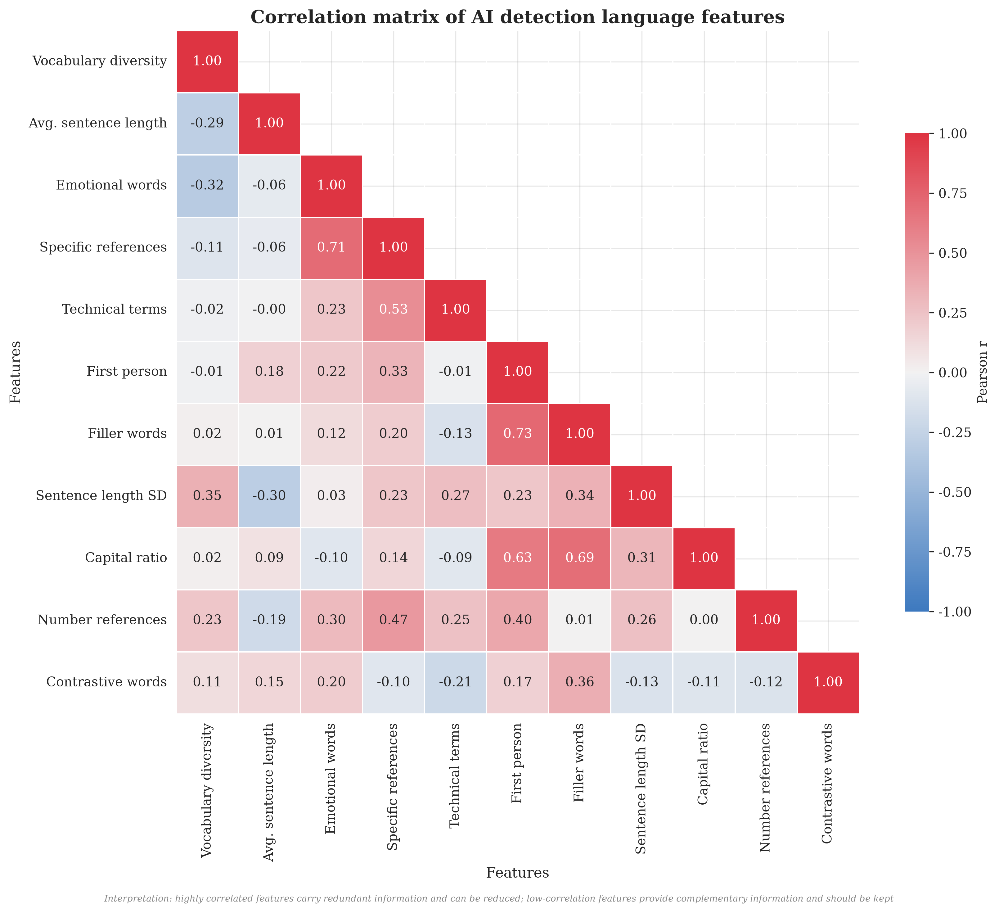

Repository inputs include 42,358 observed album rows across three third-party archives, 116,384 published critic excerpts in the training archive, 4,102 deduplicated cross-platform matches, 17,274 legacy synthetic rows, and eight collection-event audit rows at the latest check. The source manifest records URLs, dates, licenses, limitations, and archive checksums. Live RYM and AOTY requests remain blocked or challenged, so no failed request is converted into an observation.

Data limitations: the observed files are selected cross-sections assembled by third parties. They do not reveal when individual ratings were submitted, and the RYM publisher states no license. The forum titles and all five legacy raw files remain synthetic and excluded. The classifier has no platform-user holdout, while trust and competition parameters remain analyst assumptions. Empirical figures support descriptive baselines; scenario figures support conditional reasoning only.

## Appendix D References

[1] Akerlof, G. A. (1970). The Market for 'Lemons': Quality Uncertainty and the Market Mechanism. Quarterly Journal of Economics, 84(3), 488-500.

[2] Spence, M. (1973). Job Market Signaling. Quarterly Journal of Economics, 87(3), 355-374.

[3] North, D. C. (1990). Institutions, Institutional Change and Economic Performance. Cambridge University Press.

[4] Luhmann, N. (1979). Trust and Power. Wiley.

[5] Granovetter, M. (1978). Threshold Models of Collective Behavior. American Journal of Sociology, 83(6), 1420-1443.

[6] Bai, J., & Perron, P. (1998). Estimating and Testing Linear Models with Multiple Structural Changes. Econometrica, 66(1), 47-78.

[7] Chow, G. C. (1960). Tests of Equality Between Sets of Coefficients in Two Linear Regressions. Econometrica, 28(3), 591-605.

[8] Ostrom, E. (1990). Governing the Commons: The Evolution of Institutions for Collective Action. Cambridge University Press.

[9] Gillespie, T. (2018). Custodians of the Internet: Platforms, Content Moderation, and the Hidden Decisions That Shape Social Media. Yale University Press.

[10] Vaswani, A., et al. (2017). Attention Is All You Need. NeurIPS 2017.

[11] Bommasani, R., et al. (2022). On the Opportunities and Risks of Foundation Models. Stanford CRFM.

[12] Epstein, Z., et al. (2023). Art and the Science of Generative AI. Science, 380(6650), 1110-1111.

[13] Mitchell, E., et al. (2023). DetectGPT: Zero-Shot Machine-Generated Text Detection using Probability Curvature. ICML 2023.

[14] Sadasivan, V. S., et al. (2023). Can AI-Generated Text be Reliably Detected? arXiv:2303.11156.

[15] IFPI. (2026). Global Music Report 2026.

[16] European Commission. (2024). The EU Artificial Intelligence Act.

[17] C2PA. (2024). Content Credentials: Technical Specification v2.0.

[18] Archived data sources: [Kauvin Lucas, AOTY/Metacritic ratings and reviews](https://www.kaggle.com/datasets/kauvinlucas/30000-albums-aggregated-review-ratings); [tabibyte, AOTY top 5,000](https://www.kaggle.com/datasets/tabibyte/aoty-5000-highest-user-rated-albums); [Bryan O., RYM top 5,000](https://www.kaggle.com/datasets/tobennao/rym-top-5000).

## Appendix E List of Figures and Tables

### I. Analysis Figures (Figure 1-Figure 12)

| Number | Figure title | Content description | Corresponding analysis technique |
| --- | --- | --- | --- |
| Figure 1 | AI Impact Timeline | Verified policy and AOTY product dates beside the observed evidence base | Documented timeline + archive counts |
| Figure 2 | Structural Breakpoint Analysis | Synthetic pre/post comparison, rolling statistics, and descriptive CUSUM | Chow + CUSUM + Bai-Perron-style segmentation |
| Figure 3 | Comparison of AI and Human Review Features | Original figure title; published critic excerpts compared with manually authored assistant-style controls | Standardized feature differences |
| Figure 4 | Comparison of Rating Distribution Evolution | Exact-match AOTY-RYM score agreement and calibration | Hexbin correlation + difference distribution |
| Figure 5 | Trust Threshold Model | Deterministic curves under selected assumptions | Logistic trust scenario + network parameter |
| Figure 6 | Parameter Sensitivity Analysis | alpha/beta/gamma sensitivity under selected values | Deterministic parameter sweep |
| Figure 7 | User-Heterogeneity Trust Thresholds | Heterogeneous trust curves of four types of users | Heterogeneous parameter simulation |
| Figure 8 | Four-Dimensional Impact Assessment of the AI Shock | Analyst-coded four-dimension scenario | Selected ordinal scores |
| Figure 9 | Comparison of Policy Intervention Effects | Comparison under assumed policy multipliers | Deterministic policy scenario |
| Figure 10 | Genre Impact Heatmap | Observed score, attention, review density, and coverage by shared genre | Standardized heatmap + archive counts |
| Figure 11 | Competitive Landscape Positioning Map | Equal-size points using analyst-coded positions | Selected data-depth and social-experience scores |
| Figure 12 | Feature Correlation Heatmap | Correlations in the critic-excerpt and manually authored control corpus | Descriptive feature analysis |

### II. Illustrative Figures (Figure A-Figure K)

| Number | Figure title | Purpose description |
| --- | --- | --- |
| Figure A | Music Information Service Value Chain | Show the niche of AOTY/RYM in the independent music industry chain |
| Figure B | Development History Timeline | Show the evolution context of the four stages from Web 1.0 to the generative AI shock |
| Figure C | Comparison of UGC Incentive Structures | Compare contributor incentives under two assumed conditions |
| Figure D | The Lemons-Market Mechanism of the Evaluation Market | Explain the mapping relationship of Akerlof's lemons market theory on UGC evaluation platforms |
| Figure E | Heterogeneous Trust Curves | Show the differentiated trust threshold curves of four types of user groups |
| Figure F | The Four-Fold Institutional Logic of the AI Shock | Organize the scenario across technology, rules, organization, and value |
| Figure G | Platform Strategic Response Matrix | Show the two-dimensional matrix of the four strategies of defense/offense/institution/ecosystem |
| Figure H | Revaluation of Data Asset Value | Show the four-fold effects of data assets under the AI shock |
| Figure I | Career Development Route in the Trust Economy | Illustrate one possible route from analysis to governance leadership |
| Figure J | Trust Literacy Competency Model | Group useful technical, policy, and communication skills |
| Figure K | Trust Threshold Curve | Illustrate a nonlinear curve under selected parameters |

## Data Ethics Statement

The collectors use rate limits, identify blocked or challenged responses, and record collection events without converting them into observations. Current live attempts produced no verified platform rows. No personally identifiable information is intentionally collected or analyzed. Every synthetic row now carries explicit provenance fields. Any future collection should be checked against the applicable terms, robots guidance, privacy requirements, and research-ethics rules before use.
